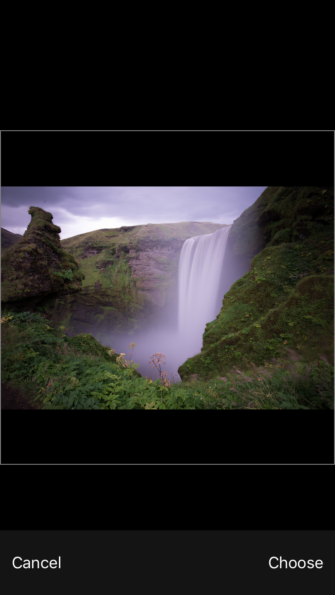
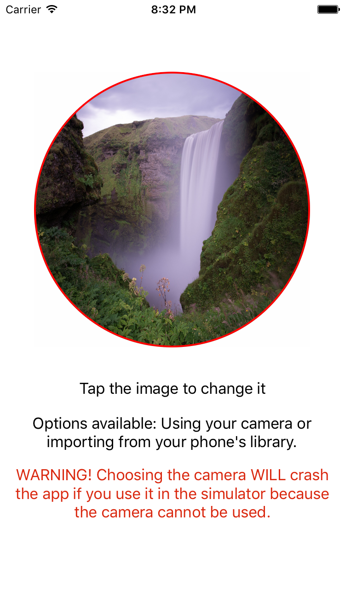

# ImageSelection
 
This demo allows users to change a picture to one from their photo library or take a new one from their camera.

In the center of the ViewController is a UIImageView. The user may click on the UIImageView to be provided with two options: 
open their photo library ORRR use their camera. 

Choosing the photo library gives the user the option to choose an image from their photo library which will then be set as the
UIImageView's image.
Additionally, they may use their camera to take an image as well.

<h2>REMEMBER!</h2>
For iOS 10, you must add these two to your Info.Plist with a string message that appears explaining why you want users to 
allow usage. 
<h2>NSPhotoLibraryUsageDescription</h2>
<h2>NSCameraUsageDescription</h2>
<h3>The app will crash otherwise and tell you that you need this. It will be displayed in the error log</h3>
Uses:

UITapGestureRecognizer - to provide a 'tap action' to the UIImageView
UIAlertController - to give the user options when the UIImageView is tapped

